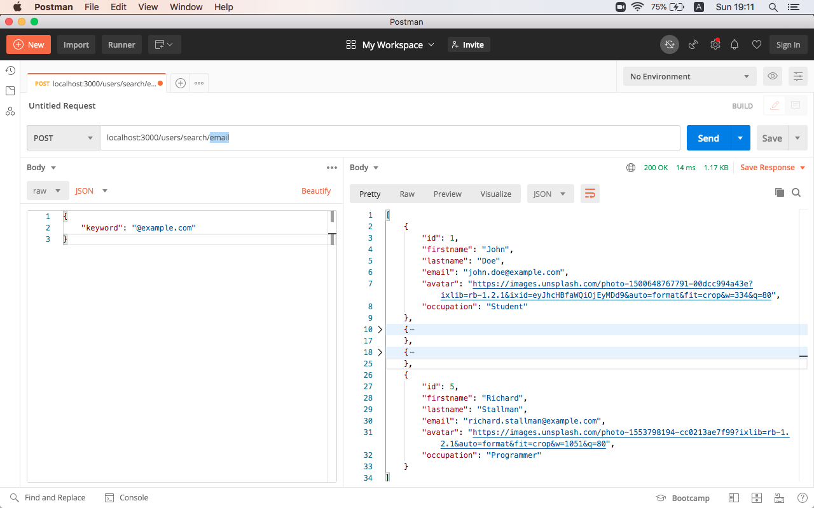

# WAD 2020 Exam: Project C

## Project setup
```
npm install
```

### Compiles for development
```
npm start
```


# Setup

Fork this project!

Make sure that your newly created project is **private** 
and only **you and me** have access to it, otherwise tasks will not be graded.

To see how to change repository visibility to private 
and add collaborators click [here](https://docs.github.com/en/enterprise-server@2.21/github/administering-a-repository/setting-repository-visibility#making-a-repository-private-1) 
and [here](https://docs.github.com/en/free-pro-team@latest/github/setting-up-and-managing-your-github-user-account/inviting-collaborators-to-a-personal-repository)

My email and username on github is: `cotne.kekelia@yahoo.com` and `tsotnekekelia`

# Tasks
Modify [users.js](./routes/users.js)

- Add a new `POST` route `localhost:3000/users/search/:property`, 
where property is a rout path parameter and represents one of the properties of the user object
property can be: `id`, `firstname`, `lastname`, `email`, `avatar`, `occupation` 
- In `POST` request body your endpoint will receive an object `{ keyword: "text" }`
- Endpoint should read local [users.js](./data/users.js) file and return only those user objects where property (passed in route path) 
value contains text passed in the `POST` request body, 
if no matches found return empty response with status code 404

For example:




